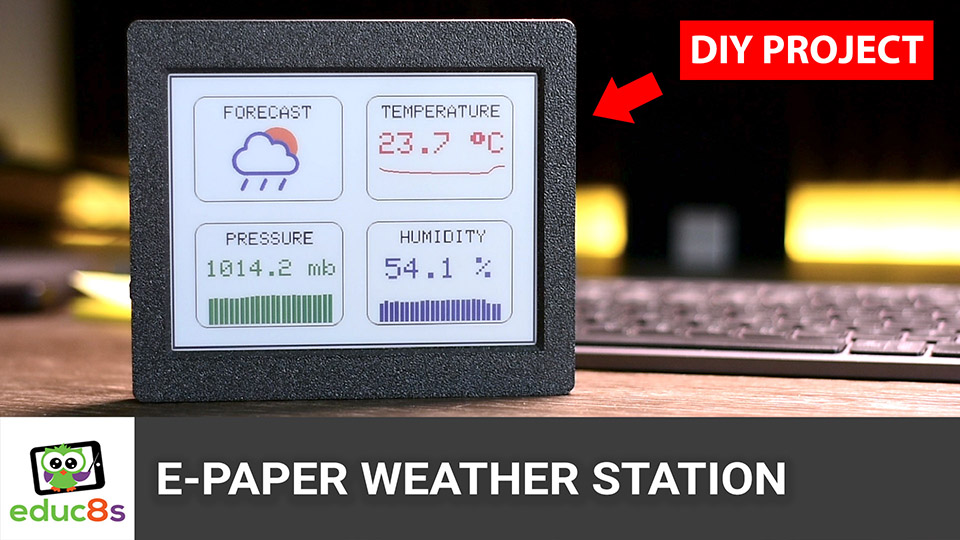

# Arduino Color E Paper Weather Station

This is a project I've wanted to build for over a decade now. I've finally made it and I am really excited– a battery-powered weather station project. I've built many weather station projects in the past, but this one is different. It can last on batteries for months. The reason for this is the amazing E-Paper display it uses. As you can see, we have a large, 6-inch E-Paper display that can display 7 colors combined with an ESP32 microprocessor.

On the display, we show the temperature, humidity, barometric pressure, and weather forecast. We get the temperature, humidity, and barometric pressure from two sensors, and the weather forecast from the internet.

# Video Tutorial

  

🎥 <a href="https://youtu.be/AzechYMLUGY">Video Tutorial on YouTube</a>

 
 

| 📺 <a href="https://www.youtube.com/educ8s">YouTube</a>
| 🌍 <a href="http://www.educ8s.tv">Website</a> |  

# Parts Needed

🛒 E-Paper Board: https://educ8s.tv/part/ColorEPaper

🛒 DHT22: https://educ8s.tv/part/DHT22

🛒 BMP180: https://educ8s.tv/part/BMP180
